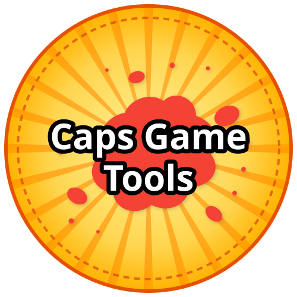
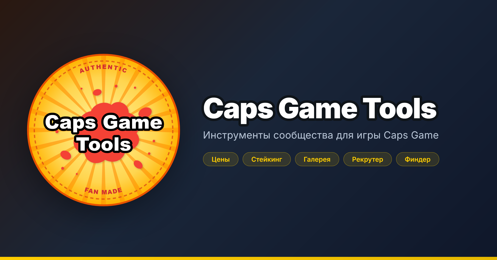

#  Caps Game Tools



Инструменты сообщества для игры **[Caps Game](https://t.me/CapsGameBot/play)** — просмотр открытых данных, аналитика рынка и оценка коллекций.

> ⚠️ Проект **не связан** с разработчиками Caps Game. Все данные берутся из публичного API игры (Firestore) — того же, что и в клиенте. Никакие приватные данные не собираются.

---

## Возможности

### 🏷️ Минимальные цены
Floor-цены на фишки Caps по коллекциям и редкостям — в TON и SOL.
- Разбито по табам: `special`, `event`, `community`, `premium`, `common`
- 9 редкостей (COMMON → DIAMOND)
- Кэш на 15 минут
- Показывает floor в каждой валюте отдельно (не конвертирует)

### 🌡️ Тепловая карта стейкинга
Сколько TON нужно заплатить за единицу скорости фарма в каждой коллекции.
- 4 редкости: `RARE`, `EPIC`, `LEGEND`, `DIAMOND`
- Цвет ячейки — по логарифмической шкале коэффициента
- Чем ниже коэффициент — тем выгоднее коллекция для стейкинга
- Цветовые пороги от «очень выгодно» (< 5) до «переоценено» (> 80)

### 🖼️ Галерея коллекций
Просмотр всех фишек коллекции с автоматической генерацией изображений.
- Разбито по типам коллекций
- Мини-карточки с логотипами
- Модалка с полным набором фишек и характеристиками
- Информация о тираже, сожжённых, дате релиза

### 👤 Mad Caps Recruiter
Оценка коллекционера по открытым данным.
- Ключевые метрики: лига, Diamond, скорость фарма, уровень копилки, всего фишек
- Распределение по редкостям, завершённые коллекции
- Боевая статистика (PvP / PvE / PvE New / Madness / Обмены)
- Уровни боссов
- Достижения, события, премиум-статус

### 🔍 Caps Finder
Поиск фишек по номеру.
- Статус фишки (на продаже, в стейкинге, сожжена…)
- Владелец (из истории)
- Коллекция, редкость, NFT-флаг

---

## Технологии

- **Чистый HTML + CSS + JavaScript** — без сборки, без фреймворков
- **Firestore REST API** — прямые запросы к публичной базе игры
- **localStorage** для кэша (15 минут)
- **Inter** — шрифт интерфейса
- **Bootstrap Icons** — только иконки, без Bootstrap CSS
- **Тёмная тема** в стиле игры (жёлто-золотой акцент, тёмно-синий фон)

---

## Структура

```
caps-game-tools/
├── index.html # Портал со ссылками на инструменты
├── market.html # Минимальные цены
├── staking.html # Тепловая карта стейкинга
├── collections.html # Галерея коллекций
├── recruiter.html # Оценка коллекционера
├── finder.html # Поиск фишек по номеру
├── css/
│ └── common.css # Общие стили, тёмная тема, переменные
└── js/
 └── common.js # Общие функции и API-хелперы
```

---

## API

Все инструменты работают через публичный Firestore REST API игры:
| Что | Endpoint |
| --- | --- |
| Коллекции | Static/CapsCollections |
| Фишки и цены | runQuery на коллекции Caps |
| Скорости стейкинга | CapsGD/v1 (поле staking) |
| Профили игроков | Users/{tgId} |
| Двор и заявки | SquadsV2/{squadId} и SquadsV2/{squadId}/Requests |
| Хранилище картинок | Firebase Storage (collections/…) |

Все запросы кэшируются на 15 минут через localStorage, чтобы не дёргать API слишком часто.

## Дисклеймер

Проект создан энтузиастами сообщества Caps Game:

- Не является официальным продуктом игры
- Не связан с командой разработчиков
- Не собирает приватные данные игроков (кошельки, балансы, личные сообщения)
- Показывает только то, что и так видно в клиенте игры через открытый API
- Использует публичные Storage-URL картинок, которые отдаются игрой

Если ты представляешь команду Caps Game и хочешь что-то поправить или попросить убрать — открой issue, ответим.

Ссылки

- 🎮 [Игра в Telegram](https://t.me/CapsGameBot/play)

- 📢 [Новости EN](https://t.me/CapsGame)

- 🇷🇺 [Новости RU](https://t.me/CapsGameRu)

- 📖 [Wiki проекта](https://github.com/capsgame/capsgame/wiki/Welcome-to-CapsGame)


## Благодарности

Сделано с уважением к сообществу Caps Game. Если инструменты оказались полезны — расскажи о них друзьям.